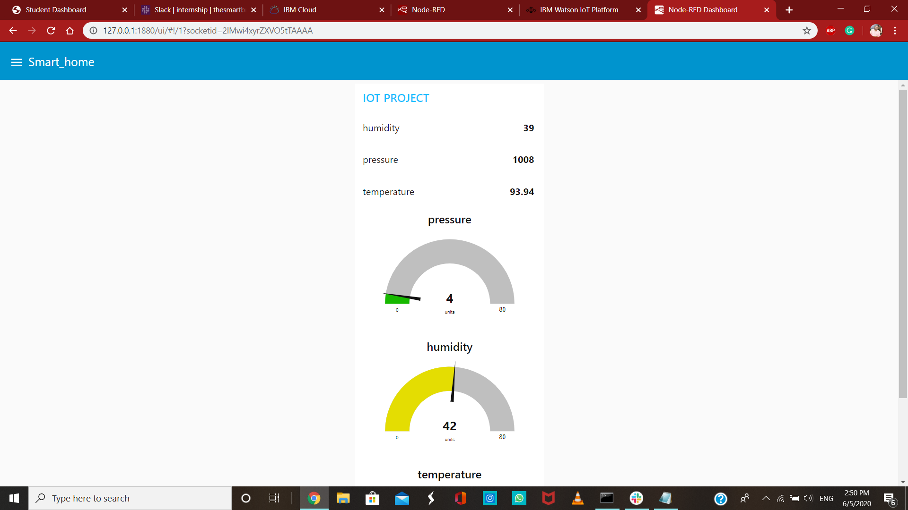
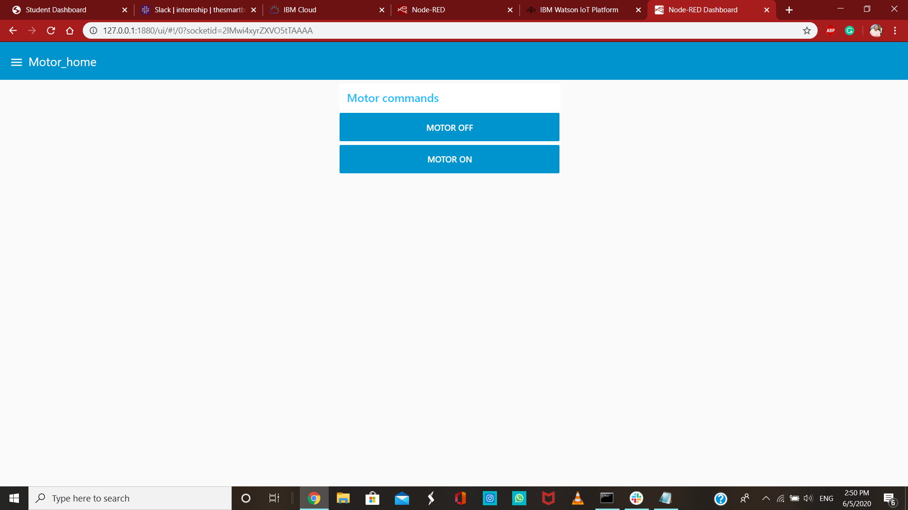
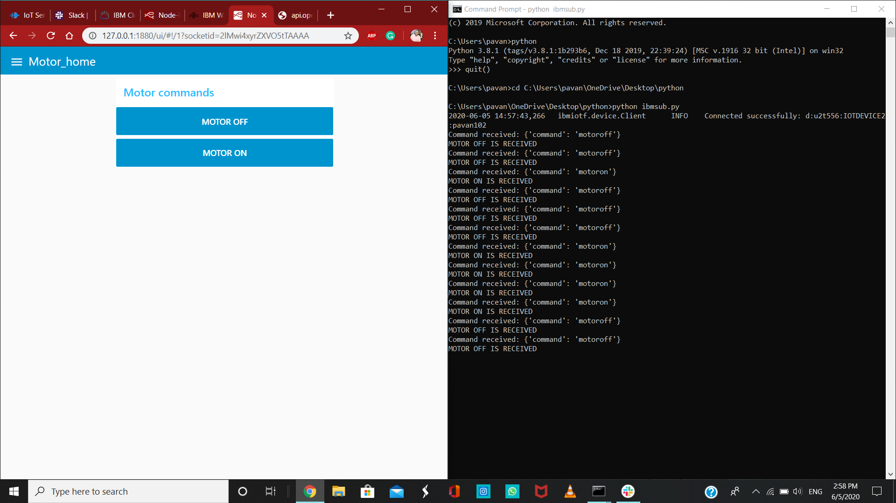

# llSPS-INT-1356-Smart-Agriculture-system-based-on-IoT(Internet of things)
### This is a system which enables farmers to monitor and control their farms with a web-based application built with Node-RED. It uses IBM IoT Watson cloud platform as its backend.
#### I have shared the links of demo videos below which I have done on this project
## For Project Demo video link uploaded in Youtube click [here](https://youtu.be/u_bNuN1u4oM)
## For Project PPT Demo video link click [here](https://drive.google.com/file/d/10wkEkHvEF03Mupv1VzmOEbF2KOyPQyD8/view?usp=sharing)
## For Project Feedback video link click [here](https://drive.google.com/file/d/1zjnCbAOgFYrxWqO9nHvXy-zSrhMJYPgm/view?usp=sharing)
## Description
1.)Smart Agriculture System based on IoT can monitor soil moisture and climatic conditions to grow and yield a good crop.

2.)The farmer can also get the realtime weather forecasting data by using external platforms like Open Weather API.

3.)Farmer is provided a mobile app using which he can monitor the temperature,humidity and soil moisture parameters along with weather forecasting details.
Based on all the parameters he can water his crop by controlling the motors using the mobile application.

4.)Even if the farmer is not present near his crop he can water his crop by controlling the motors using the mobile application from anywhere.

5.)Here we are using the Online IoT simulator for getting the Temperature,Humidity and Soil Moisture values.

# As in this project we will built an UI with the use of NODE-RED
## Web App user Interface
### 1.) Smart_home Tab

.png)
### 2.) Controlls Tab

## Then we require python code to receive the above motor commands . Python code which i used is [here](https://github.com/SmartPracticeschool/llSPS-INT-1356-Smart-Agriculture-system-based-on-IoT/blob/master/ibmsub.py)
### Below is the picture where we are receiving commands from the UI dashboard

## For better understanding of this total project please go through [My IoT project_report](https://github.com/SmartPracticeschool/llSPS-INT-1356-Smart-Agriculture-system-based-on-IoT/blob/master/IoT%20Project_Report.pdf)
